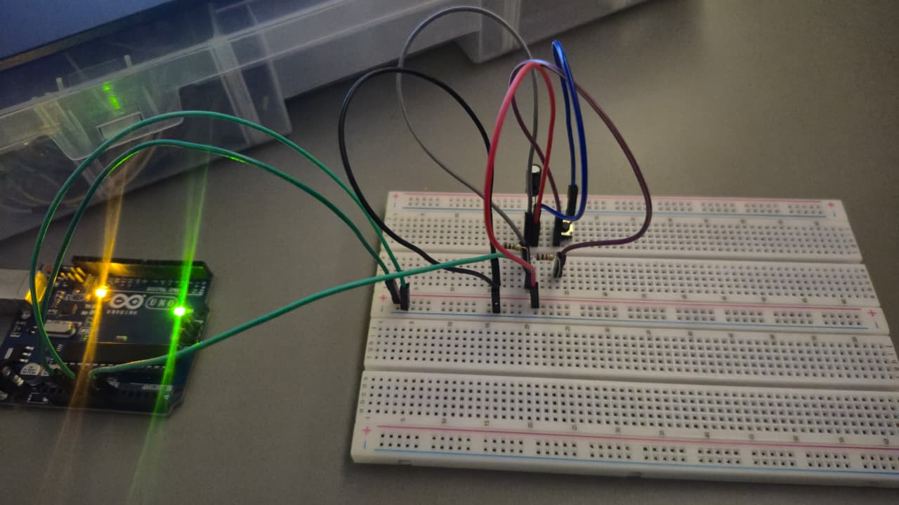
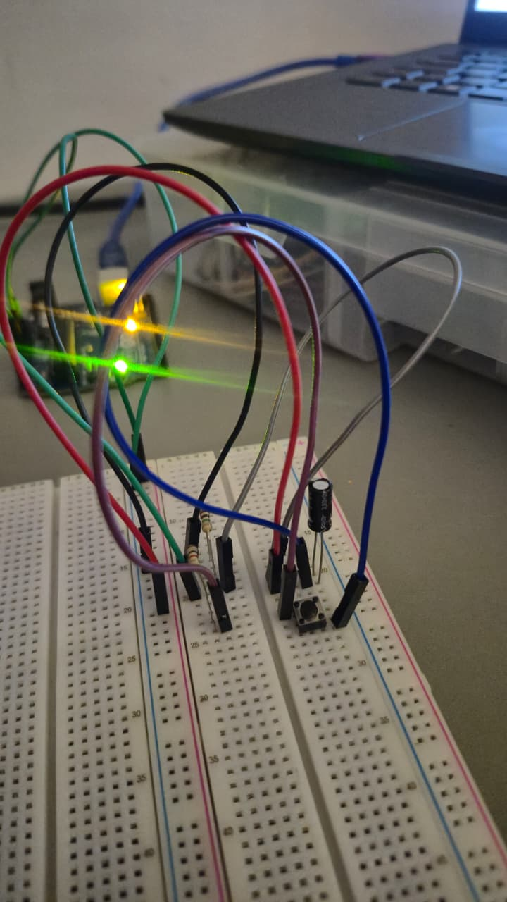
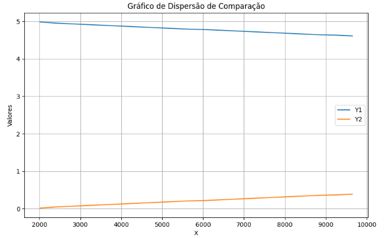

### Protótipo Arduino com Botão

   
  <em>Imagem 1: Montagem do circuito com um botão simples e o Arduino.</em>

---

   
  <em>Imagem 2: Montagem do circuito com um botão simples e o Arduino.</em>

---
### Gráfico de comparação entre a carga do Capacitor e a descarga do Resistor

   
  <em>Imagem 3: Gráfico que compara os valores para carga do capacitor e descarga do resistor.</em>

---

### Demonstração em vídeo

Execução do código no Arduino IDE, com o botão controlando os valores conforme é acionado.

*Link de acesso ao vídeo:* https://drive.google.com/file/d/1xcNdvQdJ4oIxZzeyG4fxWPJF2qazbYOd/view?usp=drive_link 
